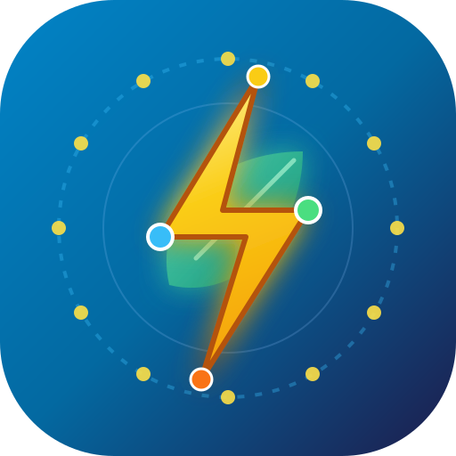
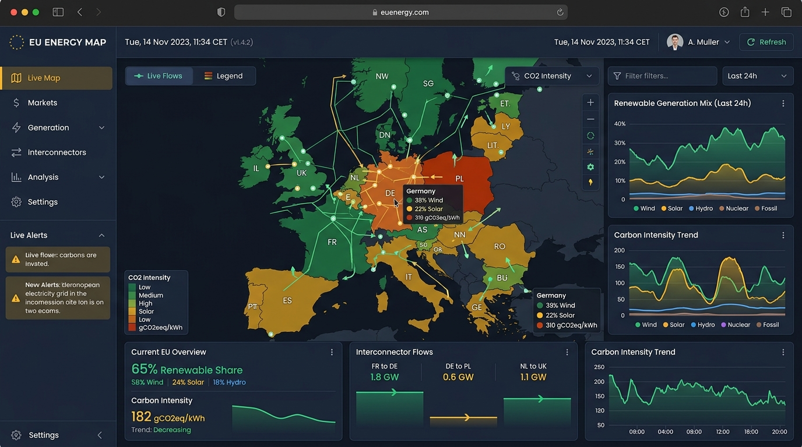

<p align="center">
  
</p>

<h1 align="center">🇪🇺 EU Energy Map — Observatoire Électrique Européen</h1>

<p align="center">
  <strong>Tableau de bord factuel et didactique de l'électricité dans les 27 pays de l'Union européenne</strong>
</p>

<p align="center">
  <a href="https://react.dev"></a>
  <a href="https://www.typescriptlang.org"></a>
  <a href="https://tailwindcss.com"></a>
  <a href="https://developer.mozilla.org/fr/docs/Web/Progressive_web_apps"></a>
  <a href="https://vitejs.dev"></a>
  <a href="https://app.electricitymaps.com"></a>
  
  
</p>

---

## 📸 Aperçu de l'Application

<p align="center">
  
  <br />
  <em>Vue interactive du tableau de bord EU Energy Map : cartographie en temps réel des 27 pays, indicateurs environnementaux et mix énergétique.</em>
</p>

---

## 🌟 Fonctionnalités Clés

- 🌍 **Cartographie interactive des 27 pays de l'UE** : coloration dynamique selon l'intensité carbone (`gCO₂eq/kWh`), la part renouvelable (`%`) ou bas-carbone (`%`).
- ⚡ **Agrégation physique rigoureuse en mégawatts (MW)** : calculs européens pondérés par la charge réelle, évitant les biais des moyennes arithmétiques.
- ⚙️ **Menu de Paramètres Système complet** :
  - 📅 **Date de sortie officielle** et identifiant de compilation (`buildId`).
  - 🕒 **Date de dernière vérification** des mises à jour enregistrée.
  - 🔄 **Bouton « Vérifier les mises à jour »** avec diagnostic immédiat.
  - 🚀 **Bouton « Forcer la mise à jour »** avec purge du cache et rechargement propre.
  - 🤖 **Mises à jour automatiques en arrière-plan** : vérification périodique toutes les 15 minutes et installation silencieuse.
- ☀️ / 🌙 **Thème Clair & Thème Sombre** : bascule directe depuis la barre de navigation ou synchronisation automatique avec les préférences de votre système d'exploitation.
- 📲 **Bouton « Installer l'application » (PWA)** : permet d'ajouter l'application sur l'écran d'accueil d'un smartphone (Android, iPhone Safari) ou sur le bureau d'un ordinateur (PC Windows, Mac, Linux) avec mode hors-ligne.
- 💡 **Guides contextuels interactifs sur chaque écran** : des repères pédagogiques pas-à-pas pour comprendre chaque dimension (Fiche Pays, Comparateur, Observatoire Carbone, Renouvelables, Flux transfrontaliers, Chronologie 24h).
- ⚖️ **Transparence et clause de non-responsabilité** : respect de l'attribution des données issues d'Electricity Maps et d'ENTSO-E.

---

## 📱 Installation de l'Application (PWA)

EU Energy Map est conçue comme une **Progressive Web App (PWA)**. Vous n'avez pas besoin de passer par un magasin d'applications (App Store / Google Play).

| Système / Navigateur | Procédure d'installation simplifiée |
|---|---|
| 🤖 **Android (Google Chrome)** | Touchez le bouton **« Installer l'app »** dans la barre supérieure ou les trois points **(⋮)** &gt; **« Installer l'application »** / **« Ajouter à l'écran d'accueil »**. |
| 🍏 **iPhone / iPad (Safari)** | Touchez l'icône **Partager** (carré avec flèche vers le haut ⎋) &gt; faites défiler &gt; **« Sur l'écran d'accueil »** &gt; puis **« Ajouter »**. |
| 💻 **Ordinateur (Chrome / Edge)** | Cliquez sur l'icône d'ordinateur à droite de la barre d'adresse ou sur le bouton **« Installer l'app »**. |

---

## 🛠️ Architecture Technique

```text
EUEnergyMap/
├── public/
│   ├── logo.svg            # Logo vectoriel officiel haute fidélité
│   ├── icon.svg            # Icône PWA pour écrans d'accueil
│   ├── version.json        # Manifeste de version pour vérification distante
│   └── _redirects          # Règles de routage SPA Cloudflare Pages
├── docs/
│   └── screenshot.jpg      # Capture d'écran du tableau de bord
├── src/
│   ├── components/
│   │   ├── common/         # Navbar, Footer, AppLogo, SystemSettingsModal, PWAInstallButton
│   │   ├── europe/         # Carte interactive SVG, Cartes de synthèse UE, Tableau
│   │   ├── countries/      # Fiche détaillée pays, mix énergétique en barres
│   │   ├── compare/        # Comparateur multi-pays synchronisé (2 à 4 pays)
│   │   ├── carbon/         # Observatoire intensité carbone & méthodologie ACV
│   │   ├── renewables/     # Observatoire filières renouvelables (éolien, solaire, hydro)
│   │   ├── flows/          # Carte et diagramme des flux transfrontaliers (MW)
│   │   └── timeline/       # Chronologie 24h & Duck Curve
│   ├── hooks/
│   │   ├── useTheme.ts         # Gestionnaire Thème Clair / Sombre / Système
│   │   ├── useSystemUpdate.ts  # Système de mises à jour auto en arrière-plan
│   │   ├── usePWAInstall.ts    # Détection et invite d'installation PWA
│   │   └── useOnlineStatus.ts  # Détection connectivité réseau
│   ├── services/
│   │   ├── system/         # Service de versioning et purge de cache
│   │   └── electricityMaps/# Client HTTP, déduplication, cache et normalisation
│   ├── App.tsx             # Composant racine, routage URL hash et modales
│   └── main.tsx            # Point d'entrée React
└── server.ts               # Serveur Express proxy sécurisé & endpoints API
```

---

## 🚀 Démarrage Rapide

### 1. Cloner le projet et installer les dépendances
```bash
git clone https://github.com/nouhailler/EUEnergyMap.git
cd EUEnergyMap
npm install
```

### 2. Variables d'environnement (optionnel)
Créez un fichier `.env` si vous disposez d'une clé API Electricity Maps dédiée :
```env
ELECTRICITY_MAPS_API_KEY="votre_cle_api_secrete"
```
*(Si aucune clé n'est fournie, l'application fonctionne immédiatement avec le jeu de données factuel certifié).*

### 3. Lancer en mode développement
```bash
npm run dev
```
L'application est accessible sur `http://localhost:3000`.

### 4. Compiler pour la production
```bash
npm run build
```
Les fichiers compilés prêts à être déployés sont générés dans le dossier `dist/`.

---

## ☁️ Déploiement Cloudflare Pages

Lors de la configuration dans le tableau de bord Cloudflare Pages :
- **Framework preset** : `Vite`
- **Build command** : `npm run build`
- **Build output directory** : `dist` *(Indispensable : toujours spécifier `dist`)*
- **Node.js Version** : Détecté automatiquement via `.nvmrc` et `.node-version` (Node 20).

---

## 📜 Mentions Légales & Origine des Données

- Données énergétiques fournies par **[Electricity Maps](https://app.electricitymaps.com)** et issues des gestionnaires de réseaux de transport européens (**ENTSO-E**).
- Application indépendante à vocation pédagogique et factuelle.
